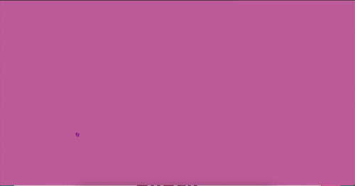
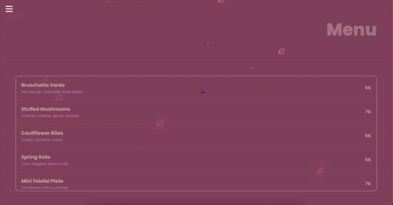
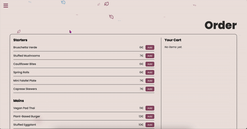
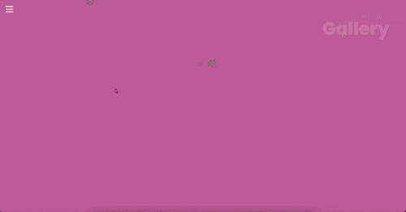
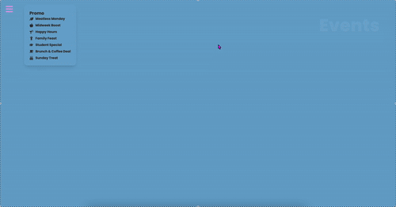
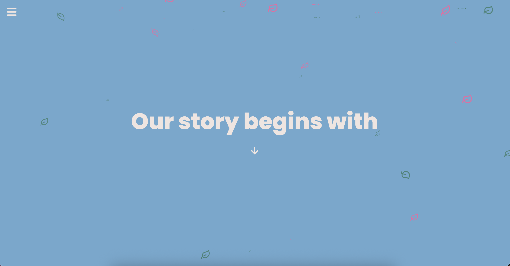

# 🌿 Cozy Leaf — Vegan Restaurant Website

A modern, animated, and fully responsive restaurant site built with **React**, **Tailwind CSS**, and **GSAP**. It features a custom animated navigation, menu with tabs, ordering with cart persistence, events calendar with promos, and elegant page transitions.

> Built by **Xebec13**.

## Features

- 🎭 **Entry “curtain” animation** for the landing navigation (GSAP + clip-path)
- 🧭 **Home tiles navigation** with subtle hovers and wind-leaf detail
- 🍽️ **Menu with tabs** (starters, mains, desserts, drinks) + soft readability background
- 🛒 **Order flow with cart** (add/remove, quantity control, **localStorage** persistence)
- 📅 **Custom Calendar** showing events + icons for daily promos
- 🎞️ **Gallery** with staggered reveal and responsive grid
- 📝 **Reservation form** with basic client-side validation
- 🌸 Global **Sakura petals** ambiance (performance-friendly)
- 📱 Fully **responsive** across breakpoints

---

## Tech Stack

- **React** + **React Router**
- **Tailwind CSS** 
- **GSAP** 
- **React Icons**
- Vite (dev server & build)

---

## Screens & GIFs

> All assets are stored locally in this repo. If you don’t have all of these, remove or rename as needed.

### 🏠 Navigation

### 📖 Menu 

### 🛒 Order 

### 📸 Gallery 

### 📅 Events 

### ℹ️ About & Contact

  
  

